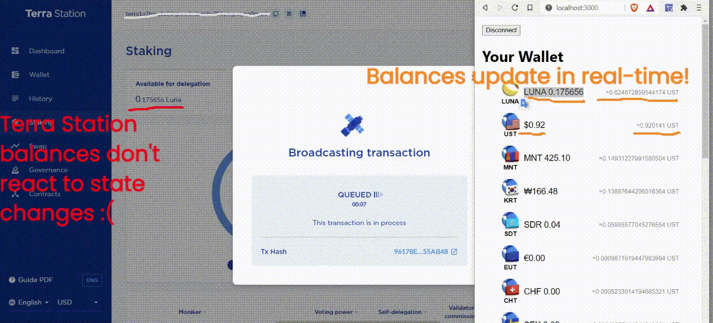

# @react-terra

---

[](https://conventionalcommits.org)
[](https://standardjs.com)
[](https://github.com/prettier/prettier)


---

⚠️Warning! This library is in a highly experimental state. It is 
not currently recommended for production use. However, contributions are 
welcome and encouraged 🚀⚠️

**👉 Visit [react-terra.dev](https://react-terra.dev) for full docs**

---

## Installation
(only hooks,. components comin soon)
```shell
  $ yarn add @react-terra/hooks
```

## Preview

### `useLiveBalances()` from `@react-terra/hooks`:


